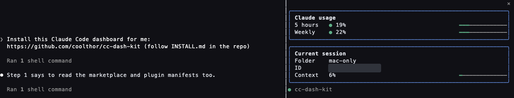
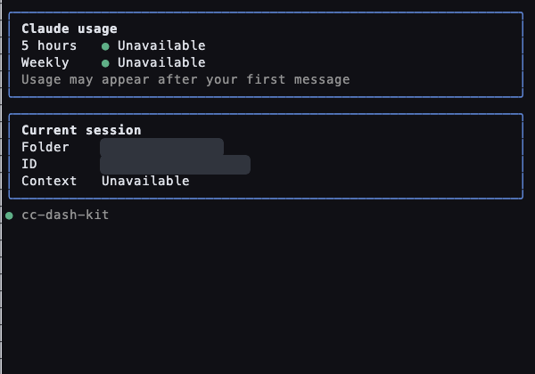
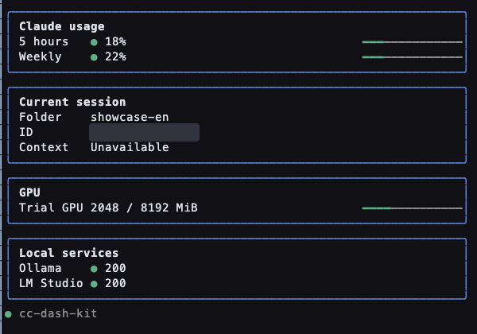

# cc-dash-kit

> Install this Claude Code dashboard for me: https://github.com/coolthor/cc-dash-kit

Claude Code: follow [INSTALL.md](INSTALL.md) and ask which installation scope to use before installing.

Your Claude Code status, right alongside the chat. · [繁體中文](README.zh-TW.md)



## One-prompt install

Paste the sentence above into Claude Code. It follows [INSTALL.md](INSTALL.md), asks before changing your terminal layout, and offers to customize the dashboard after installation.

Install without customizing:

```sh
claude plugin marketplace add coolthor/cc-dash-kit
claude plugin install --scope user cc-dash-kit@cc-dash-kit
```

User scope works across projects; use `--scope local` to try it in a single project. Reload plugins after installation. The terminal sidebar requires `/tui fullscreen`; see [INSTALL.md](INSTALL.md) for the layout step and Desktop Code behavior.

## Customize it with one prompt

> Customize this dashboard around what I check while I work.

Claude follows [ASSEMBLE.md](ASSEMBLE.md), asks three questions, and writes a local `dash.config.json`. The default quota and session cards work out of the box.

| Before: ready without config | After: GPU and two local services |
| --- | --- |
|  |  |

## Cards

| Card | Needs | When unavailable |
| --- | --- | --- |
| Claude usage | Session usage data | Shows “Unavailable” until usage data arrives |
| Session | Current session metadata | Shows available fields |
| GPU | `nvidia-smi` | Hidden |
| Disk | `df` and a configured path | Shows a read error |
| Endpoints | Configured HTTP URLs | Shows each endpoint as offline |
| Dispatch pause | Configured local flag path | Hidden until configured |

## Also in this repo: image-peek

A second mod in this repo. It shows a thumbnail of each pasted image directly under the prompt you pasted it into, instead of a bare `[Image #1]`.

```sh
claude plugin install --scope user image-peek@cc-dash-kit
```

Requires a terminal that supports the kitty graphics protocol (Ghostty or kitty, for example) and Python 3 with Pillow (`python3 -m pip install Pillow`). In other terminals, a one-line note appears where the thumbnail would be. Thumbnails are written to your system temp folder and never leave your machine.

## Safety

The mod runs with Claude Code permissions. Review its code before installing. It reads session metadata and only the local resources you configure. Endpoint checks have short timeouts. The pause button changes only its configured local flag file; `pause_status` is advisory. Never put credentials in the config.

## Development

Run `claude plugin validate .` and `claude plugin test .`. See [dash.config.example.json](dash.config.example.json) for the config shape. Local `dash.config.json` is gitignored.

## License

[MIT](LICENSE) © coolthor.
