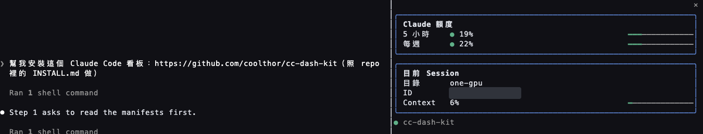
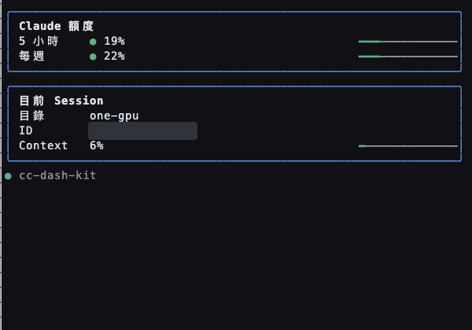
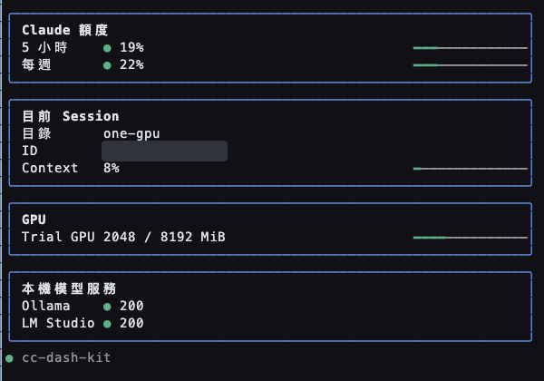

# cc-dash-kit

> 幫我安裝這個 Claude Code 看板：https://github.com/coolthor/cc-dash-kit

讓 Claude Code 的工作狀態陪在對話旁邊。 · [English](README.md)



## 一句話安裝

把上面那句貼給 Claude Code。它會依照 [INSTALL.md](INSTALL.md) 安裝，切換終端機版面前先徵求同意，完成後再詢問要不要客製。

只想安裝、不客製：

```sh
claude plugin marketplace add coolthor/cc-dash-kit
claude plugin install --scope user cc-dash-kit@cc-dash-kit
```

`user` 範圍可跨專案使用；臨時試用可改 `--scope local`。安裝後須重新載入 plugin。終端機側邊欄需要 `/tui fullscreen`；同意切換版面的步驟和 Desktop Code 說明見 [INSTALL.md](INSTALL.md)。

## 說一句話客製

> 依照我平常查看的資訊，幫我客製這個看板。

Claude 會照 [ASSEMBLE.md](ASSEMBLE.md) 問三題，將設定寫進本機 `dash.config.json`。不設定也有額度與 session 兩張卡。

| 客製前：零設定即可使用 | 客製後：GPU 與兩個本機服務 |
| --- | --- |
|  |  |

## 卡片

| 卡片 | 需要什麼 | 偵測不到時 |
| --- | --- | --- |
| Claude 額度 | Session 額度資料 | 顯示「未提供」 |
| 目前 Session | Session 資訊 | 顯示可取得的欄位 |
| GPU | `nvidia-smi` | 隱藏 |
| 磁碟 | `df` 與設定的路徑 | 顯示讀取錯誤 |
| 端點 | 設定的 HTTP 網址 | 逐一顯示離線 |
| 派工暫停 | 設定的本機旗標路徑 | 未設定時隱藏 |

## 同一個 repo 的另一個 mod：image-peek

貼圖之後，在你那則訊息正下方畫出縮圖，不再只看到一行 `[Image #1]`。

```sh
claude plugin install --scope user image-peek@cc-dash-kit
```

終端機要支援 kitty 圖形協定(例如 Ghostty、kitty)，另外需要 Python 3 和 Pillow(`python3 -m pip install Pillow`)。其他終端機會在縮圖的位置顯示一行說明。縮圖只寫在本機的系統暫存資料夾，不會上傳到任何地方。

## 安全

Mod 與 Claude Code 具有相同權限，安裝前請檢視原始碼。它讀取 session 資訊與你指定的本機資源；端點探測有短逾時。暫停按鈕只變更指定的本機旗標，`pause_status` 只是提醒。不要把憑證寫進設定。

## 開發

執行 `claude plugin validate .` 與 `claude plugin test .`。格式見 [dash.config.example.json](dash.config.example.json)；本機 `dash.config.json` 已加入 gitignore。

## License

[MIT](LICENSE) © coolthor。
